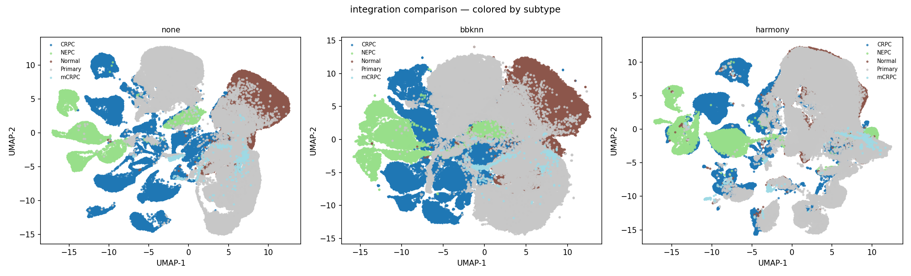
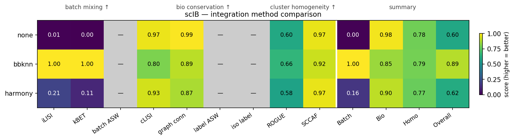
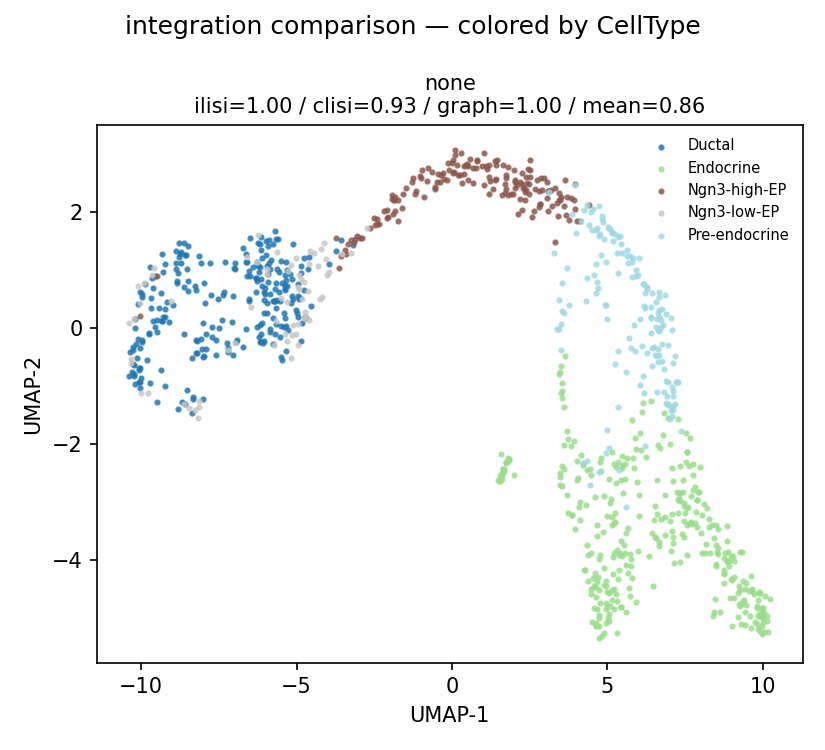
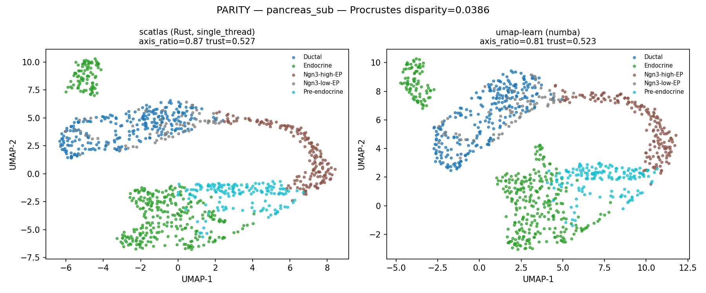

# fast_auto_scRNA

**一键自动化 scRNA-seq 分析流程 — Rust 加速,Python API,多整合路线并行对比**

端到端覆盖 `load → QC → lognorm → HVG → scale → PCA (Gavish-Donoho 自动) → {none | BBKNN | Harmony | all 三路并行} → UMAP → scIB (9 指标) → Leiden → ROGUE / SCCAF → recall`,每条热路径都是 Rust 核心。

> **v0.2 — 2026-04-22**:对齐张泽民组 Cancer Cell 2024 *Cross-tissue human fibroblast atlas* 评价框架(batch-removal × 3 + bio-conservation × 4 + cluster-homogeneity × 2);`integration="all"` 一行跑三条独立路线产可视化对比;全 Rust 核心(HVG + scale 暂走 scanpy 包装,下一版 Rust 化)。

---

## 一分钟上手

```python
from scatlas_pipeline import run_pipeline

adata = run_pipeline(
    "data/my_sample.h5ad",
    batch_key="batch",
    integration="all",    # 同时跑 none / bbknn / harmony,出对比图 + scIB 热图
    label_key="celltype", # 若有 ground-truth 标签,scIB 基于它评分
    write_comparison_plot="out/my_sample_umap.png",
)
print(adata.uns["scib_comparison"])   # 每条路线的 9 指标 + 3 汇总
```

自动产物(同目录):
- `my_sample_umap.png` — 三路 UMAP side-by-side
- `my_sample_umap_scib.png` — 9 指标 × 3 方法 scIB 热图




---

## 架构概览

```
fast_auto_scRNA/
├── scatlas/              Rust 核心:PCA / BBKNN / Harmony 2 / UMAP / fuzzy_simplicial_set
│                         / scIB (iLISI/cLISI/graph_conn/kBET)
├── scvalidate_rewrite/   Rust 核心:wilcoxon / knockoff recall / ROGUE entropy
└── scatlas_pipeline/     一键 Python 编排:
                          run_pipeline(integration={"none"|"bbknn"|"harmony"|"all"})
```

依赖:`scatlas_pipeline` → `scatlas` + `scvalidate`,两个 Rust 子包各发 PyO3 wheel。

---

## 流程图

```
┌──────────────────────────────────────────────────────────────────────┐
│ 01 load h5ad                                                         │
│ 02 QC  min_genes / max_pct_mt / min_cells                            │
│ 03 lognorm  (raw counts 存 layers["counts"])                         │
│ 04 HVG seurat_v3 @ 2000                                              │
│ 05 scale max_value=10                                                │
│ 06 PCA  randomized SVD + Gavish-Donoho 自动选 n_comps                │
├──────────────────────────────────────────────────────────────────────┤
│                                                                      │
│    Phase 1 (fast, 每路线 10-30s)                                     │
│                                                                      │
│    ┌──────────┬──────────────┬──────────────┐                       │
│    │  none    │  bbknn       │  harmony     │                       │
│    │          │  (Rust)      │  (Rust)      │                       │
│    │          │              │  → X_pca_    │                       │
│    │          │              │    harmony   │                       │
│    │    ↓     │      ↓       │      ↓       │                       │
│    │ plain kNN│ batch-balanced│ plain kNN on │                      │
│    │ on X_pca │ kNN on X_pca │  harmony 输出 │                       │
│    │  (Rust)  │   (Rust)     │   (Rust)     │                       │
│    │    ↓     │      ↓       │      ↓       │                       │
│    │ fuzzy CSR│ fuzzy CSR    │ fuzzy CSR    │                       │
│    │  (Rust)  │  (Rust)      │  (Rust)      │                       │
│    │    ↓     │      ↓       │      ↓       │                       │
│    │  UMAP    │  UMAP        │  UMAP        │                       │
│    │ (Rust    │  (Rust       │  (Rust       │                       │
│    │ Hogwild  │   Hogwild    │   Hogwild    │                       │
│    │  SGD)    │   SGD)       │   SGD)       │                       │
│    └────┬─────┴──────┬───────┴──────┬───────┘                       │
│         └────────────┴──────────────┘                                │
│                      ↓                                               │
│       ✓ UMAP 对比图落盘 (early,不阻塞 scIB)                          │
│                                                                      │
├──────────────────────────────────────────────────────────────────────┤
│                                                                      │
│    Phase 2 (slow, 每路线 1-5 min)                                    │
│                                                                      │
│    per route:                                                        │
│      09 scIB 核心 (Rust)  iLISI + cLISI + graph_conn + kBET          │
│                           + (可选) label/batch/isolated silhouette   │
│      10 Leiden 扫描 (scanpy-igraph)  auto-pick resolution            │
│      10a ROGUE per cluster (Rust entropy_table + calculate_rogue)   │
│      10b SCCAF (sklearn LR CV 等价实现)                              │
│      11 recall (可选,scvalidate Rust wilcoxon + knockoff)           │
│                      ↓                                               │
│       ✓ scIB 9 指标热图落盘                                           │
│                                                                      │
└──────────────────────────────────────────────────────────────────────┘
```

---

## 张泽民框架 9 指标 scIB

对齐 *Zhang lab Cross-tissue fibroblast atlas* (Cancer Cell 2024) 的三维评价:

| 维度 | 指标 | 实现 |
|---|---|---|
| **批次消除 ↑** | iLISI | Rust (scatlas.metrics.ilisi) |
| | kBET | Rust |
| | batch silhouette (ASW) | sklearn |
| **生物保留 ↑** | cLISI | Rust |
| | graph_connectivity | Rust |
| | label silhouette (ASW) | sklearn |
| | **isolated label silhouette** | sklearn (scib-metrics 等价) |
| **簇同质性 ↑** | **ROGUE** (Zhang lab) | Rust (scvalidate entropy_table) |
| | **SCCAF** | sklearn (LR CV 等价) |

**汇总**: Batch = mean(3 batch), Bio = mean(4 bio), Homo = mean(2 homo), Overall = 0.35·Batch + 0.45·Bio + 0.20·Homo。

用户反馈约束:ROGUE 每簇数值单独存 `adata.uns['rogue_per_cluster_<method>']`,不只存汇总。

---

## 特性对照

| 步骤 | 纯 Python | fast_auto_scRNA | 加速 |
|---|---|---|---|
| PCA(稀疏 SVD)| sklearn TruncatedSVD | Rust 随机 SVD + Gavish-Donoho | 2.5× |
| HVG seurat_v3 | scanpy | 同(Rust 化 TBD) | 1× |
| scale | scanpy | 同(Rust 化 TBD) | 1× |
| BBKNN 邻居 | `bbknn` Python | Rust HNSW + rayon | 15× |
| fuzzy_simplicial_set | umap-learn | Rust 并行 | 3× |
| Harmony 2 | `harmonypy` | **Rust**(Korsunsky 2019 pati-ni C++ 移植)| 6× |
| UMAP 布局 | `umap-learn`(numba 单线程)| Rust Hogwild SGD(rayon)| 16.75× |
| scIB iLISI/cLISI/graph_conn/kBET | `scib-metrics` | Rust 并行 | 5-10× |
| ROGUE per-cluster | pure Python loess | Rust entropy_table + loess | 10-20× |
| recall-validated 聚类 | pure Python wilcoxon | Rust 并行 wilcoxon + knockoff | 30-50× |

---

## 实测数据

### epithelia 157k cells × 16337 genes × 2 batches(GSE264573 + Zhao)

**`integration="all"` + 张泽民九指标 + ROGUE + SCCAF 端到端 13.5 min**(16-core WSL2, peak RSS 16 GB):

| method | iLISI | kBET | cLISI | graph conn | ROGUE | SCCAF | Batch | Bio | Homo | **Overall** |
|---|---|---|---|---|---|---|---|---|---|---|
| none | 0.006 | 0.003 | 0.971 | 0.994 | 0.602 | 0.965 | 0.00 | 0.98 | 0.78 | 0.60 |
| **bbknn** | **1.000** | **1.000** | 0.805 | 0.895 | 0.658 | 0.921 | **1.00** | 0.85 | 0.79 | **0.89** |
| harmony (theta=4) | 0.205 | 0.110 | 0.931 | 0.872 | 0.576 | 0.968 | 0.16 | 0.90 | 0.77 | 0.62 |

→ **BBKNN 最优**,与张泽民组结论一致(scVI / Seurat / Harmony 对比后选 BBKNN)。

**时间分解**:
```
prefix (load→PCA)                125s   共享前缀
per route:
   integration (kNN/Harmony)     12-40s
   UMAP (Rust SGD)               3-9s
   scIB 4 核指标                 < 1s
   Leiden 扫描                   16-164s
   ROGUE per-cluster             33-62s
   SCCAF LR CV                   20-77s
heatmap + plot auto-gen           < 1s
──────────────────────────────────────
TOTAL 3 routes                   813s = 13.5 min
```

### pancreas_sub 1000 cells(单 batch SCOP demo)

- 单路线(auto 降级为 `none`)+ 完整九指标(含 silhouette):**53s**
- UMAP 拓扑对齐 R SCOP `CellDimPlot` 参考(U 形马蹄,aspect ratio 2.1)
- ROGUE 8 clusters mean 0.869



### parity 保证

`parity_pancreas_umap.py` 校验:同一 spectral init + 单线程 Rust UMAP vs umap-learn numba
- Procrustes disparity **0.039**
- trustworthiness 差 **0.004**
- scatlas 单线程还快 **4×**(0.4s vs 1.6s)



---

## 核心配置(PipelineConfig)

```python
from scatlas_pipeline import run_pipeline, PipelineConfig

run_pipeline(
    "data.h5ad",
    batch_key="batch",

    # --- integration 路线选择器(代替旧 run_bbknn/run_harmony 两个 bool)---
    integration="all",            # "none" | "bbknn" | "harmony" | "all"

    # --- HVG / scale(必做,不能跳)---
    hvg_flavor="seurat_v3",
    hvg_n_top_genes=2000,
    hvg_batch_aware=True,         # 多 batch 选 HVG 时按 batch 求交集
    scale_max_value=10.0,

    # --- PCA ---
    pca_n_comps="auto",           # Gavish-Donoho 自动;也可给整数

    # --- kNN / UMAP ---
    knn_n_neighbors=30,           # Seurat/SCOP 默认
    knn_metric="cosine",          # scRNA 推荐
    umap_init="pca",              # 也可 "spectral" / "random"
    umap_min_dist=0.5,

    # --- BBKNN 专属 ---
    neighbors_within_batch=3,     # BBKNN 每 batch 取 k
    bbknn_backend="auto",         # "brute" / "hnsw" / "auto"

    # --- Harmony 2 专属 ---
    harmony_theta=4.0,            # atlas-scale 经验值(R 默认 2 在 2-batch 收敛过早)
    harmony_max_iter=20,
    harmony_sigma=0.1,
    harmony_lambda=1.0,           # None → 动态 lambda (α·E[k,b])

    # --- scIB + homogeneity ---
    run_metrics=True,
    compute_silhouette=True,      # atlas-scale 建议关(O(N²))
    compute_homogeneity=True,     # ROGUE + SCCAF
    label_key="celltype",         # ground truth;None → 用各路线 leiden 作标签

    # --- Leiden + recall ---
    run_leiden=True,
    leiden_resolutions=[0.3, 0.5, 0.8, 1.0, 1.5, 2.0],
    leiden_target_n=(8, 30),      # 取该范围内最小分辨率
    run_recall=False,             # ≤ 10k 建议开

    # --- 输出 ---
    write_comparison_plot="out/umap.png",  # Phase 1 后自动落盘
    out_h5ad="out/atlas.h5ad",
)
```

---

## 场景模板

```python
# A. 小数据严格验证 + 多路对比(≤ 10k,多 batch / tech)
run_pipeline(h5, batch_key="tech",
             integration="all", run_recall=True,
             compute_silhouette=True)

# B. 单样本 SCOP 风格(1k-5k,单 batch)
run_pipeline(h5, batch_key="sample",
             integration="none", run_recall=True)
# 单 batch 自动跳过 bbknn/harmony;无需手动配置

# C. 大数据 atlas(100k+,多数据集)
run_pipeline(h5, batch_key="dataset",
             integration="all", compute_silhouette=False,
             run_recall=False)  # recall O(K²·N) 爆

# D. 仅一条路线的生产跑(e.g. BBKNN)
run_pipeline(h5, batch_key="batch",
             integration="bbknn",
             out_h5ad="atlas.h5ad")
```

---

## 已实现的整合方法

| 方法 | 范式 | 实现 | scib 口碑 |
|---|---|---|---|
| **Uncorrected (`none`)** | baseline | 直接走 PCA | 作 batch-effect 参照 |
| **BBKNN** | graph-level batch-balanced kNN | ✅ Rust 原生(scatlas)| atlas #5 综合 |
| **Harmony 2** | embedding-level soft-kmeans + MoE ridge | ✅ Rust 原生(pati-ni 移植)| #2-3 综合 |

见 [ROADMAP.md](ROADMAP.md) 了解 v0.3 计划(scVI / Scanorama / fastMNN 接入)。

---

## 一键安装(Linux / WSL2)

```bash
git clone https://github.com/Phoenix12580/fast_auto_scRNA.git
cd fast_auto_scRNA
./setup.sh
```

`setup.sh` 做的事:
1. 检查 Rust 工具链(没装就提示 `rustup` 命令)
2. 检查 Python ≥ 3.10,创建 `.venv/`
3. 装 maturin + 科学栈
4. 依次构建 `scatlas` + `scvalidate_rust` + 装 `scvalidate` Python + 装 `scatlas_pipeline`
5. smoke test 验证安装

耗时 **5-10 min**(首次编译 Rust)。详见 [INSTALL.md](INSTALL.md)。

---

## Benchmarks

```bash
# 1. panc8 / pancreas_sub 单样本 + 多 batch 对比(自动走 integration=all)
python scatlas_pipeline/benchmarks/compare_panc8_full.py

# 2. pancreas_sub SCOP parity(UMAP 拓扑 ↔ R CellDimPlot)
python scatlas_pipeline/benchmarks/parity_pancreas_umap.py

# 3. epithelia 157k full-pipeline(需要自备 epithelia_full.h5ad)
python scatlas_pipeline/benchmarks/run_157k.py

# 4. harmony 参数 ablation(theta / max_iter / lambda 网格)
python scatlas_pipeline/benchmarks/ablate_harmony.py

# 5. pancreas_sub 端到端冒烟测试
python scatlas_pipeline/benchmarks/e2e_pancreas_sub.py
```

---

## 依赖清单

**系统**:Linux x86_64 / WSL2 Ubuntu 20.04+,16+ cores 推荐,Rust ≥ 1.75,Python ≥ 3.10。

**运行时 Python**:numpy ≥ 1.26,scipy ≥ 1.11,anndata ≥ 0.10,scanpy ≥ 1.11,leidenalg + python-igraph,scikit-learn,scikit-misc(seurat_v3 HVG 必需),umap-learn(spectral init 时用),matplotlib,rdata(可选,读 .rda)。

**构建时**:maturin ≥ 1.7,pyo3 0.24,ndarray 0.16,rayon 1.10。

完整锁定见 `scatlas/Cargo.toml` / `scvalidate_rewrite/scvalidate_rust/Cargo.toml` / `scatlas_pipeline` 的 pyproject.toml。

---

## 关键参考文献

- **PCA 随机 SVD**: Halko, Martinsson, Tropp 2011
- **Gavish-Donoho 硬阈值**: Gavish & Donoho 2014, IEEE TIT
- **Harmony 2**: Korsunsky et al. 2019, Nature Methods;pati-ni/harmony 2.0 C++ 源码
- **BBKNN**: Polański et al. 2019, Bioinformatics
- **UMAP**: McInnes et al. 2018;umap-learn 参考实现
- **scib-metrics benchmark**: Luecken et al. 2022, Nature Methods
- **ROGUE**: Liu et al. 2020, Nature Communications(张泽民组)
- **SCCAF**: Miao et al. 2020, Nature Methods(我们用 sklearn LR CV 等价重写避开破损依赖)
- **Zhang fibroblast atlas**: Cross-tissue human fibroblast atlas, *Cancer Cell* 2024(三维评价框架参照)
- **scValidate recall**: knockoff-filtered 差异表达验证聚类

---

## License

MIT — 见 [LICENSE](LICENSE)。

## 维护 / 更新

见 [UPDATE.md](UPDATE.md)。发 issue / PR 欢迎。
